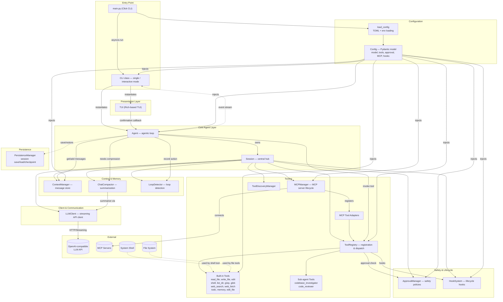
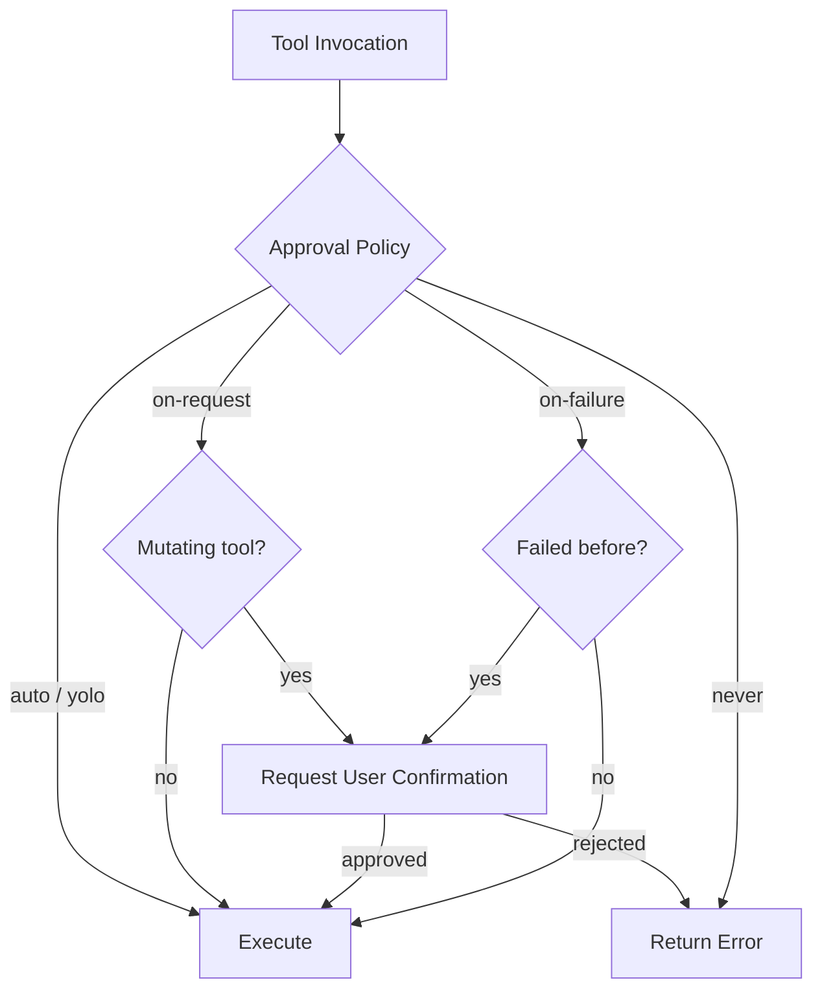

<div align="center">
  <h1>💎 Jade</h1>
  <p><strong>The Most Extensible AI Coding Agent for your Terminal</strong></p>
</div>

---

**Jade** is a next-generation, terminal-first AI coding agent designed to bridge the gap between "chat" and "ship." Unlike traditional LLM chat interfaces, Jade is built for **autonomous engineering workflows**, providing a robust, safety-first environment where a reasoning-capable AI can interact directly with your file system, shell, and external services.

At its core, Jade follows a sophisticated **agentic loop**—autonomously planning, executing, and verifying its work through a specialized toolset. Whether it's deep codebase investigation, automated refactoring, or real-time security auditing, Jade is designed for high-stakes terminal productivity.

### ✨ Why Jade?

- 🧠 **Reasoning First**: Optimized for advanced reasoning models (like Qwen3.2+), allowing the agent to stream its "thoughts" out loud before touching a single line of code.
- 🔌 **Deep Extensibility (MCP)**: Built with native support for the **Model Context Protocol (MCP)**, allowing it to instantly connect to any MCP server for specialized tools and expanded context.
- ⚓ **Lifecycle Hooks**: Every action is governed by a flexible **Bash Hook** system. Trigger custom scripts before or after the agent runs, or around specific tool executions (like auto-linting after file edits).
- 🛡️ **Hardened Safety**: Built-in loop detection, automatic token compression, and custom **Safety Approval** policies (`auto`, `on-request`, `yolo`) ensure you always have the final say over mutating actions.
- 💻 **Premium UX**: A high-fidelity Terminal UI (TUI) powered by Rich, providing real-time streaming of thoughts, interactive tool status, and automated session persistence.

## System Architecture



## Component Overview

| Module | Path | Responsibility |
|---|---|---|
| **Entry** | `main.py` | Click-based CLI; dispatches to single-shot or interactive mode |
| **CLI** | `main.py` | Orchestrates the event loop between Agent and TUI; handles `/` commands |
| **Agent** | `agent/agent.py` | Runs the agentic loop (LLM call → tool execution → repeat) |
| **Session** | `agent/session.py` | Central hub wiring all subsystems together at initialization |
| **Events** | `agent/events.py` | Typed event types for the agent/event-stream protocol |
| **Persistence** | `agent/persistence.py` | Save, list, resume sessions; create/restore checkpoints |
| **LLMClient** | `client/llm_client.py` | Async OpenAI-compatible client with streaming & retry logic |
| **Response** | `client/response.py` | Stream event types & data models (TextDelta, ToolCall, TokenUsage) |
| **ContextManager** | `context/manager.py` | Stores conversation messages, tracks tokens, prunes old tool results |
| **ChatCompactor** | `context/compaction.py` | Summarizes long conversations when context window is near capacity |
| **LoopDetector** | `context/loop_detector.py` | Detects repeated tool-call / response patterns to break loops |
| **Config** | `config/config.py` | Pydantic configuration: model, approval, hooks, MCP, tools |
| **ConfigLoader** | `config/loader.py` | Loads configuration from TOML files and environment variables |
| **ToolRegistry** | `tools/registry.py` | Registers, validates, and dispatches tool invocations |
| **Built-in Tools** | `tools/builtin/*.py` | read_file, write_file, edit, shell, list_dir, grep, glob, web_search, web_fetch, todo, memory, edit_file |
| **Sub-agents** | `tools/subagents.py` | codebase_investigator, code_reviewer — specialized agents as tools |
| **MCPManager** | `tools/mcp/mcp_manager.py` | Lifecycle management of MCP (Model Context Protocol) servers |
| **MCP Tool** | `tools/mcp/mcp_tool.py`, `client.py` | Adapts MCP tools into the Tool interface |
| **Discovery** | `tools/discovery.py` | Auto-discovers and registers tools at session start |
| **Approval** | `safety/approval.py` | Enforces approval policies (`auto`, `on-request`, `never`, `yolo`, etc.) |
| **HookSystem** | `hooks/hook_system.py` | Triggers user-defined hooks before/after agent or tool execution |
| **TUI** | `ui/tui.py` | Rich-based terminal UI — streaming output, tool status, welcome screen |

## Agentic Loop Flow

```
User Input
    │
    ▼
┌─────────────────────────────────┐
│ Agent.run(message)              │
│   1. Trigger before_agent hook  │
│   2. Add user message to context│
│   ┌─────────────────────────┐   │
│   │  For each turn:         │   │
│   │  1. Compress context if │   │
│   │     needed (compaction) │   │
│   │  2. Call LLM (streaming)│   │
│   │  3. Yield text deltas   │   │
│   │  4. Collect tool calls  │   │
│   │  5. For each tool call: │   │
│   │     a. before_tool hook │   │
│   │     b. Safety approval  │   │
│   │     c. Execute tool     │   │
│   │     d. after_tool hook  │   │
│   │     e. Store result     │   │
│   │  6. Check for loops     │   │
│   │  7. Prune old tool      │   │
│   │     outputs             │   │
│   └─────────────────────────┘   │
│   8. Trigger after_agent hook   │
└─────────────────────────────────┘
    │
    ▼
Final response to User
```

## Tool Safety Model



## Configuration Hierarchy

1. **Default** values in `ModelConfig` / `Config` Pydantic models
2. **TOML file** loaded by `config/loader.py`
3. **Environment variables** (`API_KEY`, `BASE_URL`)
4. **CLI flags** (`--model`, `--temp`, `--cwd`) — highest priority

## Directory Structure

```
jade/
├── main.py                 # CLI entry point (Click)
├── pyproject.toml          # Project metadata & dependencies
│
├── agent/                  # Core agent logic
│   ├── agent.py            # Agent class & agentic loop
│   ├── session.py          # Session hub — wires all subsystems
│   ├── events.py           # Agent event types
│   └── persistence.py      # Session save/load/checkpoints
│
├── client/                 # LLM communication
│   ├── llm_client.py       # Async OpenAI-compatible streaming client
│   └── response.py         # Stream event models
│
├── config/                 # Configuration
│   ├── config.py           # Pydantic Config model
│   └── loader.py           # TOML + env config loader
│
├── context/                # Conversation context management
│   ├── manager.py          # Message store, token tracking, pruning
│   ├── compaction.py       # Conversation summarization
│   └── loop_detector.py    # Agentic loop detection
│
├── tools/                  # Tool system
│   ├── base.py             # Tool base class & interfaces
│   ├── registry.py         # Tool registration & dispatch
│   ├── discovery.py        # Auto-discovery of tools
│   ├── subagents.py        # Sub-agent tools
│   ├── builtin/            # Built-in tools (file, shell, web, etc.)
│   └── mcp/                # MCP server client & tool adapters
│
├── safety/
│   └── approval.py         # Approval/safety policies
│
├── hooks/
│   └── hook_system.py      # Lifecycle hook triggers
│
├── prompts/
│   └── system.py           # System prompt generation
│
├── ui/
│   └── tui.py              # Rich-based terminal UI
│
├── utils/                  # Utilities
│
├── scripts/                # Utility scripts
│
└── ai-agent/
    └── tools/              # AI-agent tool configs
```
